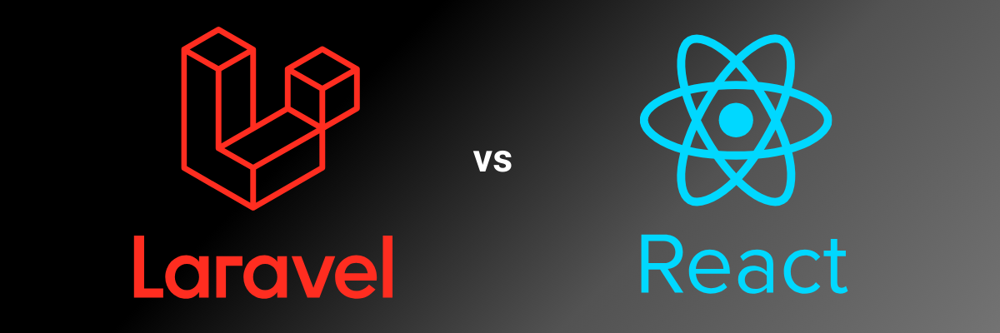

# TimeWorX Project - (28-08-2024)



## 💡 Introduction

Welcome to **TimeWorX Project**! This is our project, developed by Võ Gia Huy and Lê Nguyễn Bảo Trân, aimed at creating an efficient time management and planning website. The project is built with modern technology to provide an optimal user experience. Võ Gia Huy serves as the **Full Stack Developer**, responsible for developing all components of the project, while Lê Nguyễn Bảo Trân plays a crucial role in **Business Analysis**, ensuring that the project meets business needs and user experience expectations.


## 🚀 **Project Information**

- **Frontend**: React.js, Vite.js
- **Backend**: Laravel
- **Database**: MySQL

## 💡 **Features**

### **For Individuals**

- **Meeting Management**: Helps users organize their daily tasks and manage time more effectively.
- **Personal Work Calendar**: Allows users to create and manage their personal work schedules.
- **View Company Work Calendar**: Users can view the company's work calendar assigned by project managers, helping them review and organize their tasks more efficiently.

### **For Organizations**

- **Employee Management**: Project managers can easily manage employees with features like creating meeting schedules and assigning tasks.
- **Task Assignment**: Allows for creating and assigning tasks to employees.
- **Progress Dashboard**: Provides an overview of each team member's progress.
- **Comments**: Commenting feature for exchanging ideas and information among team members.
- **Personal Task Management**: Project managers can use it to organize their own tasks.


## 📦 **Setup**

1. **Clone Repository:**

- First, clone the repository to your local machine:

```bash
   git clone https://github.com/vogiahuy257/LaravelAndNextProject.git
```

2. **Setup Frontend:**

- Navigate to the breeze-next directory and install dependencies:

```bash
    cd breeze-next
    npm install
```

3. **Setup Backend:**

- Navigate to the breeze-next directory and install dependencies:

```bash
    cd api
    composer install
```

- **Database Configuration::**

- Create a MySQL database and configure the connection details in the .env file located in the /api directory.

 

- After setup, run the following command to initialize the database with Laravel migrations:

```bash
 php artisan migrate
```

4. **Running the Application:**

- Open two terminal tabs:
 
- **Backend:**

In one terminal, start the backend server:

```bash
 php artisan serve
```

- **Frontend:**: 

In the other terminal, start the frontend application:

```bash
   npm install && npm run dev
```
 
- **Open your browser and navigate to:**: http://localhost:3000
- **Now, you are ready to use the application with both frontend and backend running.**

## 🌐 **About Us**

### **Võ Gia Huy**

- **Role**: Full Stack Developer
- **GitHub**: [https://github.com/vogiahuy257](https://github.com/vogiahuy257)
- **Portfolio Page**: [https://vogiahuy257.github.io/VoGiaHuyProfolioReactjs/](https://vogiahuy257.github.io/VoGiaHuyProfolioReactjs/)
- **Facebook**: [Gia Huy Vo](https://www.facebook.com/profile.php?id=100023020324055)
- **LinkedIn**: [Võ Gia Huy](https://www.linkedin.com/in/v%C3%B5-gia-huy-2045352bb/)

### **Lê Nguyễn Bảo Trân**

- **Role**: Business Analyst
- **LinkedIn**: [Le Nguyen Bao Tran](https://www.linkedin.com/in/lenbtr/)
- **Facebook**: [Bảo Trân (Cheese)](https://www.facebook.com/profile.php?id=61552261400890)

## 📞 **Contact**

### **Võ Gia Huy**
  - **Email**: [vogiahuy257@gmail.com](mailto:vogiahuy257@gmail.com)
  - **Phone Number**: 0908335809

### **Lê Nguyễn Bảo Trân**
  - **Email**: [lngbaotran3008@gmail.com](lngbaotran3008@gmail.com)
  - **Phone Number**: 0348033026


