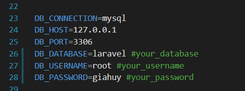

# TimeWorX Project - (28-08-2024)
<div align="center">
  
</div>

## 💡 Introduction

Welcome to TimeWorX Project! This is our project, developed by Võ Gia Huy and Lê Nguyễn Bảo Trân, aimed at creating an efficient time management and planning website. The project is built with modern technology to provide an optimal user experience. Võ Gia Huy serves as the Full Stack Developer, responsible for developing all components of the project, while Lê Nguyễn Bảo Trân plays a crucial role in Business Analysis, ensuring that the project meets business needs and user experience expectations.

---

## 🛠 Tech Stack

| **Frontend**                                                                 | **Backend**                                                                  | **Database**                                                              |
|:-----------------------------------------------------------------------------:|:---------------------------------------------------------------------------:|:-------------------------------------------------------------------------:|
| <div style="text-align: center; padding: 10px;">  <br /> React.js </div> | <div style="text-align: center; padding: 10px;">  <br /> Laravel </div> | <div style="text-align: center; padding: 10px;">  <br /> MySQL </div> |


---

## 🌟 Features

### **👤 For Individuals**

- **Meeting Management**: Helps users organize their daily tasks and manage time more effectively.
- **Personal Work Calendar**: Allows users to create and manage their personal work schedules.
- **View Company Work Calendar**: Users can view the company's work calendar assigned by project managers, helping them review and organize their tasks more efficiently.

### **🏢 For Organizations**

- **Employee Management**: Project managers can easily manage employees with features like creating meeting schedules and assigning tasks.
- **Task Assignment**: Allows for creating and assigning tasks to employees.
- **Progress Dashboard**: Provides an overview of each team member's progress.
- **Comments**: Commenting feature for exchanging ideas and information among team members.
- **Personal Task Management**: Project managers can use it to organize their own tasks.

---

## 🚀 Getting Started

### Prerequisites
- PHP: Version 8.3.7+
- MySQL: Version 8.0.37+

### Setup

1. **Clone Repository**
   ```bash
   git clone https://github.com/vogiahuy257/TimeWorXProject.git
   cd TimeWorX
   ```

2. **Setup Frontend**
   ```bash
   npm install && npm run dev
   ```

3. **Setup Backend**
   ```bash
   composer install
   ```

4. **Database Configuration**
   - Create a MySQL database
   - Configure .env file in /api directory

   

5. **Run Migrations**
   ```bash
   php artisan migrate
   php artisan migrate:fresh --seed
   ```

6. **Run Application**

   To run the application, **open 3 terminal tabs** and execute the following commands:
   
     1. **Backend:**
        - In the first terminal, run the following command to start the backend server:
        ```bash
        php artisan serve
        ```

     2. **Queue Worker:**
        - In the second terminal, start the queue worker:
        ```bash
        php artisan queue:work
        ```

     3. **Frontend:**
        - In the third terminal, run the following command to start the frontend application:
        ```bash
        npm run dev
        ```

   - **Visit the application:**
     - Open your browser and navigate to [http://localhost:8000](http://localhost:8000).

---

## 👥 About Us

### Võ Gia Huy
- 💻 Full Stack Developer
- [GitHub](https://github.com/vogiahuy257) | [Portfolio](https://vogiahuy257.github.io/VoGiaHuyProfolioReactjs/) | [Facebook](https://www.facebook.com/profile.php?id=100023020324055) | [LinkedIn](https://www.linkedin.com/in/v%C3%B5-gia-huy-2045352bb/)

### Lê Nguyễn Bảo Trân
- 📊 Business Analyst
- [LinkedIn](https://www.linkedin.com/in/lenbtr/) | [Facebook](https://www.facebook.com/profile.php?id=61552261400890)

